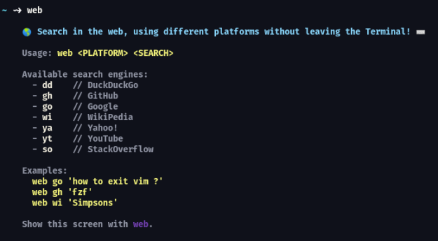

<h1 align="center">Web</h1>

### Web is a simple CLI that allows you to search in web (in different platforms) without leave the terminal!



### Requirements:

- gcc 10.2.1+

### Install

Clone the repo:

```
$ git clone https://github.com/LuisHenriqueFA14/web && cd web
```

Build:

```
$ c++ src/web.cpp include/opener.c/opener.o include/opener.c/deps/os.c/os.o -o web
```

### Contributing

If you found some bug, or want a new feature, open an issue (or a PR), it will help a lot! :smiley:
